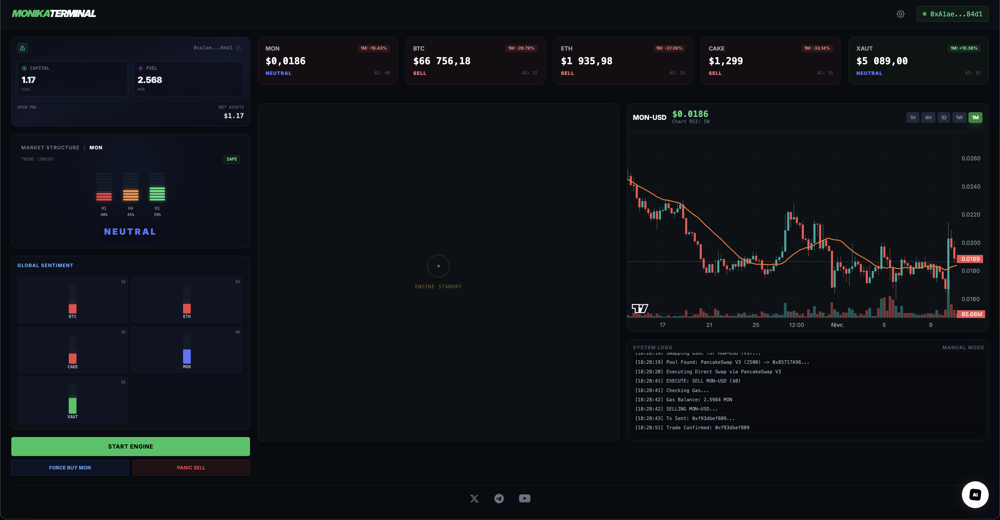

# MONIKA TERMINAL: Autonomous DeFi Agent on Monad

[](https://www.youtube.com/watch?v=fUe2NX_qWSI)

Monika is an elite, fully autonomous DeFi Trading Agent built natively for the **Monad Mainnet**. Powered by a hybrid Neural Engine (KNN Pattern Matching + Gemini AI) and executing via high-speed smart routing, Monika doesn't just suggest trades—she executes them dynamically on-chain without human intervention.

---

## Project Overview

Monika operates through two distinct interfaces, blending high-performance DeFi execution with an immersive AI personality.

### 1. Monika Terminal (`/trading`) - *The Core Engine*
This is the heart of the project. The terminal is a Bloomberg-style interface where users can monitor the agent's real-time thought process and execution.



* **The Brain (Neural Engine):** Uses a K-Nearest Neighbors (KNN) algorithm to match real-time candlestick fractals against historical data across multiple timeframes (H1, H4, D1).
* **Trend Shield:** Combines the KNN score with RSI momentum and an SMA-50 trend filter to calculate a final "AI Confidence Score" (0-100).
* **Auto-Pilot Execution:** If the AI Confidence Score exceeds 55 in a bullish trend, Monika autonomously drafts a transaction and signs it on the Monad blockchain.
* **Smart Routing:** Failsafe execution layer that automatically routes trades through PancakeSwap V3, Uniswap V3, or dynamic Multihop paths (via WMON/WETH) depending on liquidity.

### 2. GF Mode (`/`) - *The Immersive Persona*
Before entering the hardcore trading terminal, users can interact with Monika in "GF Mode"—a fully rendered 3D interactive interface. This showcases the agent's personality, allowing users to converse with her using natural language (powered by Gemini/Gemma/ElevenLabs) before trusting her with their capital.

---

## Monad Integration

Monika is inextricably linked to the Monad Mainnet. We chose Monad because an autonomous agent requires ultra-low latency and cheap gas to perform high-frequency fractal trading effectively. 

**How we leverage Monad:**
* **Real-Time On-Chain State:** Monika constantly polls Monad RPCs to check gas balances (`monGas`) and token holdings to prevent "dust" transaction failures.
* **Complex Multi-DEX Routing:** Because liquidity on new chains can be fragmented, our `executeTrade` logic doesn't rely on one DEX. Monika natively constructs `solidityPacked` paths to execute:
  1. Direct Swaps on **PancakeSwap V3** (`0x1b81D...`)
  2. Fallback to **Uniswap V3 / SwapRouter02** (`0xfe31f...`)
  3. **Smart Multihops**: Automatically finding paths via WMON or WETH if direct pairs lack liquidity.
  4. **V2 Factory Fallbacks** for older liquidity pools.

### Supported Monad Contracts
* **WMON:** `0x3bd359C1119dA7Da1D913D1C4D2B7c461115433A`
* **USDC:** `0x754704Bc059F8C67012fEd69BC8A327a5aafb603`
* **PancakeSwap V3 Router:** `0x1b81D678ffb9C0263b24A97847620C99d213eB14`
* **Uniswap V3 Router:** `0xfe31f71c1b106eac32f1a19239c9a9a72ddfb900`

---

## Architecture & Technology Stack

**Frontend (Client-Side Wallet Security)**
* **React.js & Vite:** High-performance terminal rendering.
* **Ethers.js (v6):** Handles encrypted wallet storage (`Wallet.encrypt()`), transaction signing, and ABI contract interactions entirely client-side so private keys never touch the backend.
* **TechnicalIndicators:** Local calculation of RSI and SMA.

**Backend (The Oracle)**
* **Node.js & Express:** Lightweight server for fetching and caching market data.
* **Google Generative AI (Gemini):** Powers the conversational agent (`/api/chat`) and allows the agent to explain her market structure logic in natural language.
* **Smart Batching Engine:** Fetches 5m, 1h, and 1d candles in parallel to prevent API rate limits while keeping data live.

---

## Setup & Deployment Instructions

### Prerequisites
* Node.js (v18+)
* A Google Gemini API Key
* An ElevenLabs API Key
* Monad Mainnet RPC access
* An EVM wallet with at least 2 million $MONIKA, 1 USDC and 1 MON

### 1. Backend Setup
```bash
cd backend
npm install

Create a .env file in the /backend directory:

PORT=3000
GEMINI_API_KEY=your_gemini_api_key_here
ELEVENLABS_API_KEY=your_elevenlabs_api_key_here

Start the backend engine:
npm run start

Frontend Setup
cd frontend
npm install

Start the Vite development server:
npm run dev
```

## Usage
Navigate to http://localhost:5173.
Experience the 3D GF Mode or proceed directly to /trading.
Create a burner wallet within the app (encrypted via password).
Fund the wallet with a small amount of MON (for gas) and USDC on Monad.
Click START ENGINE to enable Auto-Pilot, force buy to manually open a position, or use the AI Chat in the bottom right to ask Monika about current market conditions.

## ⚖️ License & Attribution
This project is open-sourced under the MIT License.

### Attributions:

Data fetching architecture inspired by standard OHLCV aggregator patterns.
3D rendering utilizes standard WebGL/Three.js libraries.
Smart contract ABIs belong to their respective protocols (Uniswap Labs, PancakeSwap).
